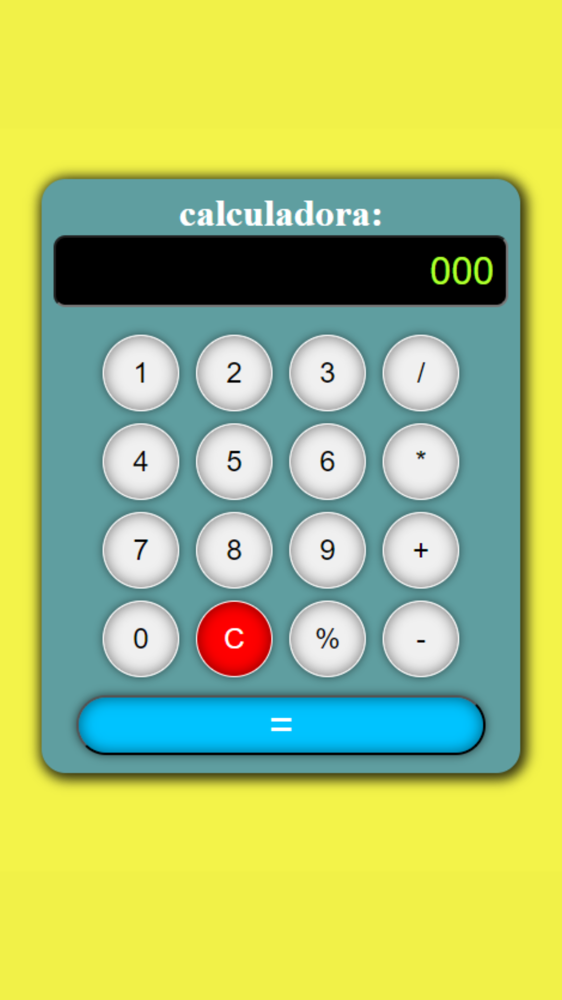

# Calculadora Simples
## Projeto de calculadora para operações básicas

## Tecnologias utilizadas
- HTML
- CSS
- JAVASCRIPT
- GIT

## Funcionalidades
- [x] Botões interativos
- [x] Display de visualização
- [x] Efetucação de cálculos matemáticos básicos

## Display

## Demonstração
[Calculadora](https://bminority.github.io/Calculadora/)

## Criado por
Bruno Coelho
[Linkedin](www.linkedin.com/in/bruno-coelho-97b630220)